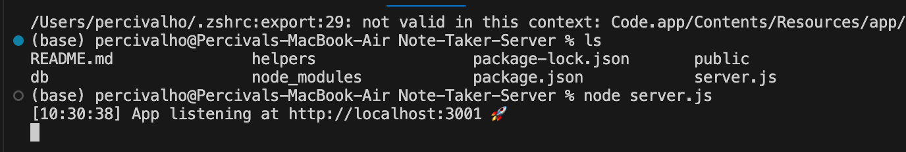
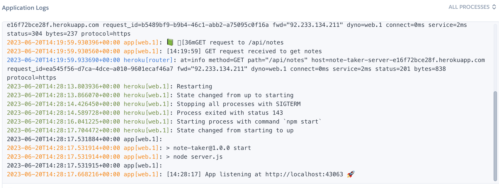
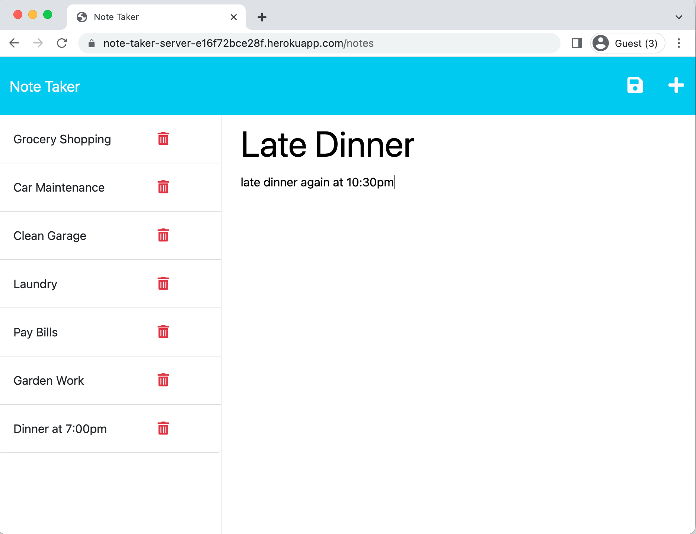
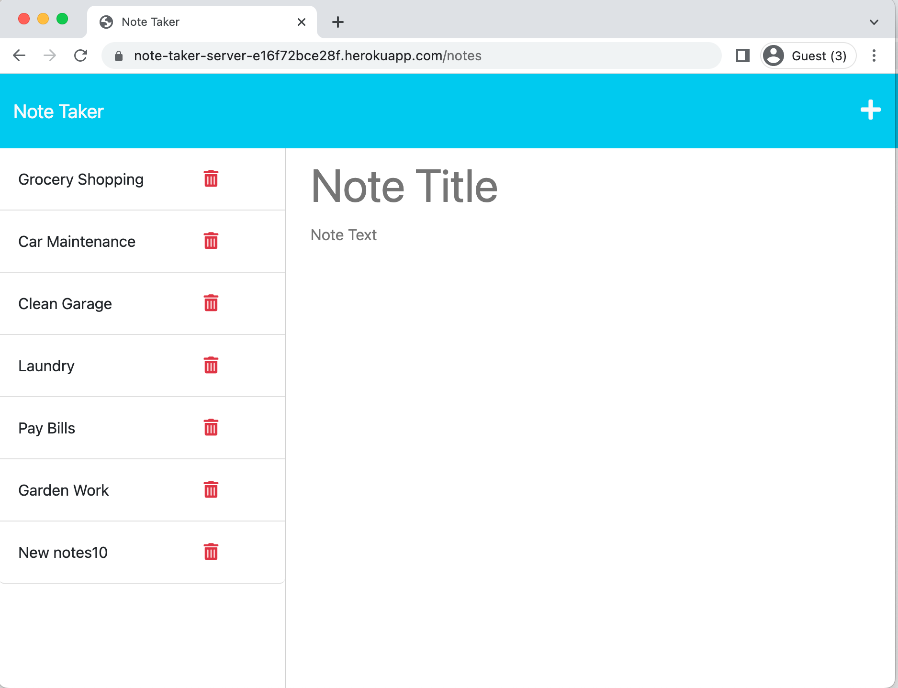
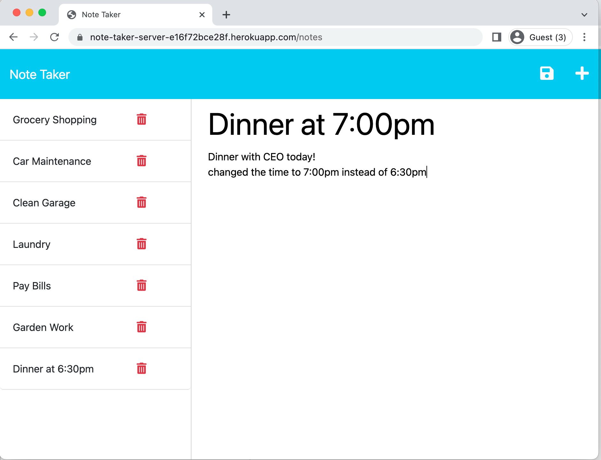
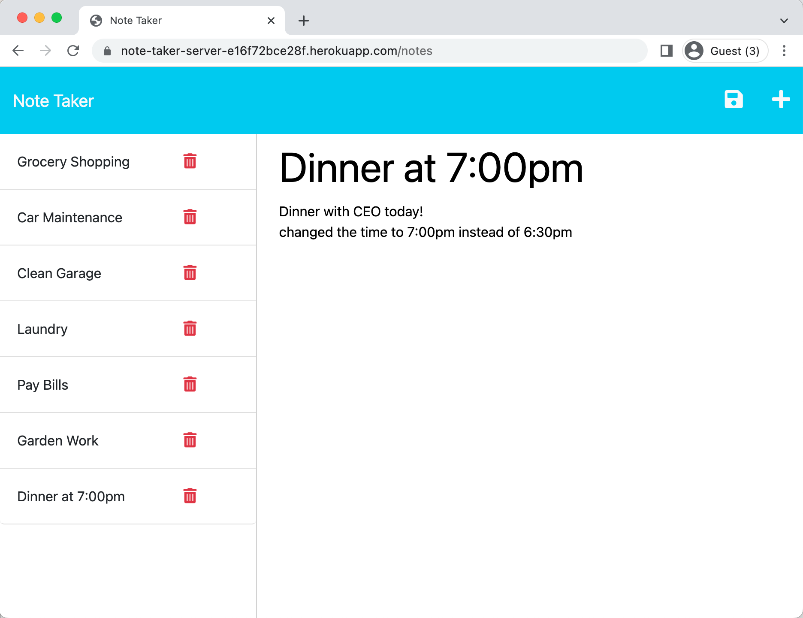
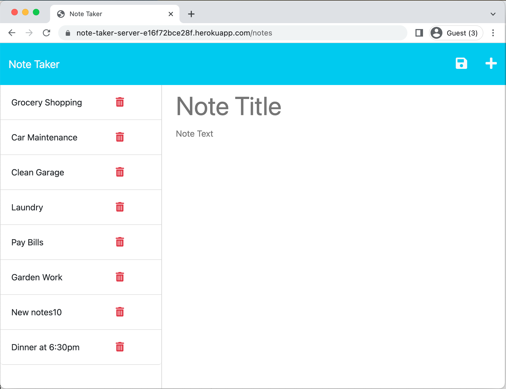
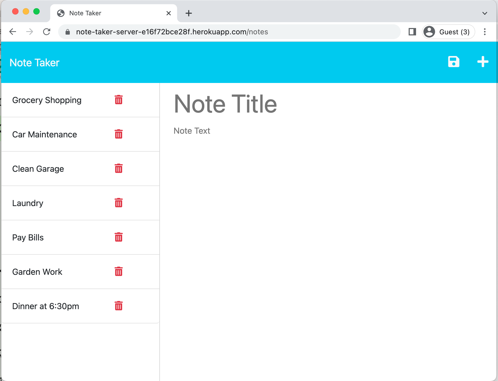
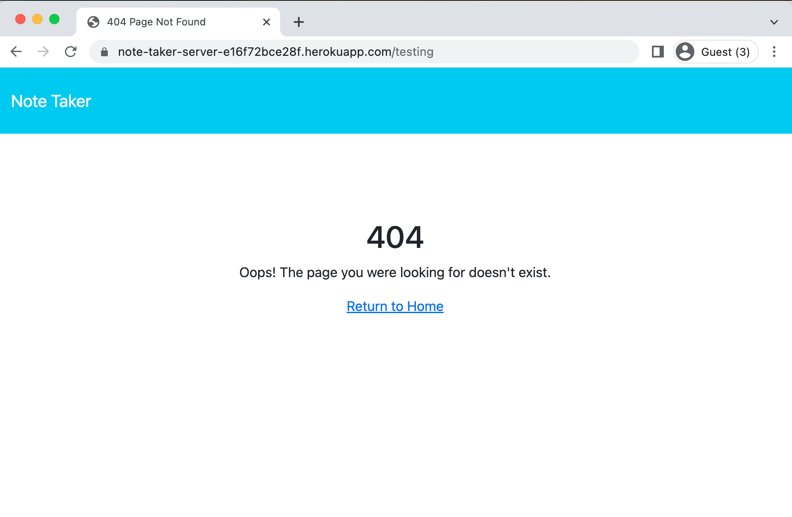

# Note-Taker-Server

The Note Taking Server is done by developing a back-end service using Express.js. The back-end service will be responsible for managing note data, including saving and retrieving notes, using a JSON file for data persistence.


## User Story

```
AS A small business owner
I WANT to be able to write and save notes
SO THAT I can organize my thoughts and keep track of tasks I need to complete
```


## Acceptance Criteria

```
GIVEN a note-taking application
WHEN I open the Note Taker
THEN I am presented with a landing page with a link to a notes page
WHEN I click on the link to the notes page
THEN I am presented with a page with existing notes listed in the left-hand column, plus empty fields to enter a new note title and the note’s text in the right-hand column
WHEN I enter a new note title and the note’s text
THEN a Save icon appears in the navigation at the top of the page
WHEN I click on the Save icon
THEN the new note I have entered is saved and appears in the left-hand column with the other existing notes
WHEN I click on an existing note in the list in the left-hand column
THEN that note appears in the right-hand column
WHEN I click on the Write icon in the navigation at the top of the page
THEN I am presented with empty fields to enter a new note title and the note’s text in the right-hand column
```

## Installation
  
to install for running in localhost:
1. Express.js. It is a flexible, minimalist web application framework for Node.js, used to build web applications, APIs, and handle HTTP requests in a streamlined and simplified way.

  ```md
  npm i express
  ```

for heroku application, no need installation, just go to:

https://note-taker-server-e16f72bce28f.herokuapp.com


## Technologies Used

This application is built using the following technologies:

- **HTML5**: Markup language for structuring content.
- **CSS**: Stylesheet language for styling HTML content.
- **JavaScript**: Programming language for adding interactivity and dynamic content.
- **NodeJS**: an open-source, cross-platform, JavaScript runtime environment that executes JavaScript code outside of a web browser.
- **Express**:  flexible, minimalist web application framework for Node.js, used to build web applications, APIs, and handle HTTP requests in a streamlined and simplified way.


## Usage

The user should clone the repository and run 'npm i express' to install express.js.  

for localhost:
The server should be sarted successfully with message:


for heroku application:



## Features

The application is capable of the full functionality of Note Taker.
It has implemented CRUD operation:
1. C (Create): 
User can create a new note with title and detail text and then click the save button to store in db.json.

Editing the New note: "Late Dinner" note


Saving the New Note: after save, note "Late Dinner" appeared in the left hand panel.


2. R (Read):
On loading up, the notes saved in db.json can be read in and loaded to the left side of the page notes.html.  also, on every create, delete and update, all the notes in db.json will be loaded once again for having updated effect.

Loading Default notes in db.json:


3. U (Update):
On clicking a note on the left pane, the details data on the particular note will be shown on the detail panel. user can edit the title and text and save to update the note to db.json with updated title/text by using the id.

Editing the note to update:


Saving the update note (the original note was "Dinner at 6:30pm" and upon saving, it changed to "Dinner at 7:00pm")


4. D (Delete):
On clicking the bin button on the note, the note will be deleted and it will also reflected in db.json.

Before Delete, it is goting to delete "New Notes10" Note 


After Delete, "New Notes10 " note deleted


Besides those CRUD features, the app has more to give:
1.  it will map to 404.html with the theme matched to existing design when no route can be found.

2.  implementing cLog function so that on there is time display when logging to console.
3.  middleware to log all the GET/POST/PUT/DELETE operations.


## Tests

Testing done on:

1. testing on successful loading up in server.js with message "App listening at http://localhost:3001 🚀"
2. testing on page index.html loading up successfully
3. testing on page notes.html loading up successfully with default notes loaded.
4. testing on New Note saved and written to db.json successfully.
5. testing on checking the id field also found in db.json for the new Note.
6. testing on delete existing Note with db.json updated.
7. testing on updating an existing Note with db.json updated. (index.js (frontend) needed to be amended in order to support update operation)
8. testing on route that can't be routed and 404.html displayed out.


## Resources

Link to Heroku:

https://note-taker-server-e16f72bce28f.herokuapp.com


Link to GitHub repo:

https://github.com/percivalho/Note-Taker-Server.git


## License 


## Credits
Bootcamp Week11 Mini-Project: 
For a number of helpers files like fsUtils.js, uuid.js, middleware/clog.js.


## Credits and Copyright 
&copy; Copyright 2023 - Present. Percival Ho